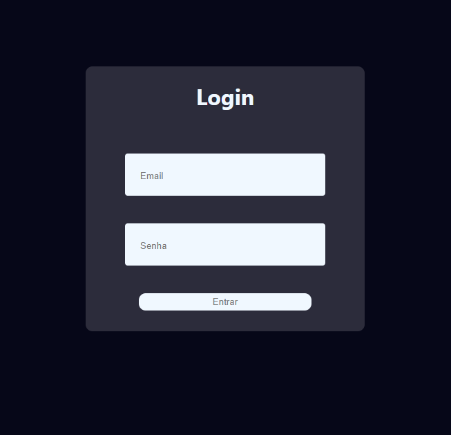
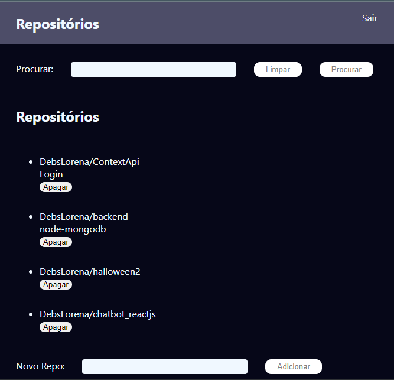

 

  <h1>Bem Vindos(as)!!</h1>
  <strong>Crud com Login</strong>

 

    
    

## ✌️ Crud com login * Frontend
<strong> Crud em ReactJs com MongoDB e Node: incluso rotas, context-api com autenticação de login e permanência com localStorage, props, search(perquisa) de repositórios apenas de usuários logados, ligação de api com axios, logout, css.
*  **Backend**: no repositório seguinte

### 🎨 Frontend

*  **ReactJS**: com Visual Studio Code 

## 🙌 Quer Contribuir?

Que tal:
* 🤔 Sugira um recurso
* 🐛 Informar um problema
* 📖 Melhore a documentação
* 👨‍💻 Contribua com o código

Você é mais que bem vindo! 

Obs: Todos os textos e imagens atuais são ficticios, projeto não concluso.

    <h6>Feito com ❤️ by DebsLorena</h6>
    <a href="https://www.linkedin.com/in/loredebs/"><strong>Linkedin</strong></a> 
    <a href="https://www.instagram.com/debslorena/"><strong>Instagram</strong></a>

